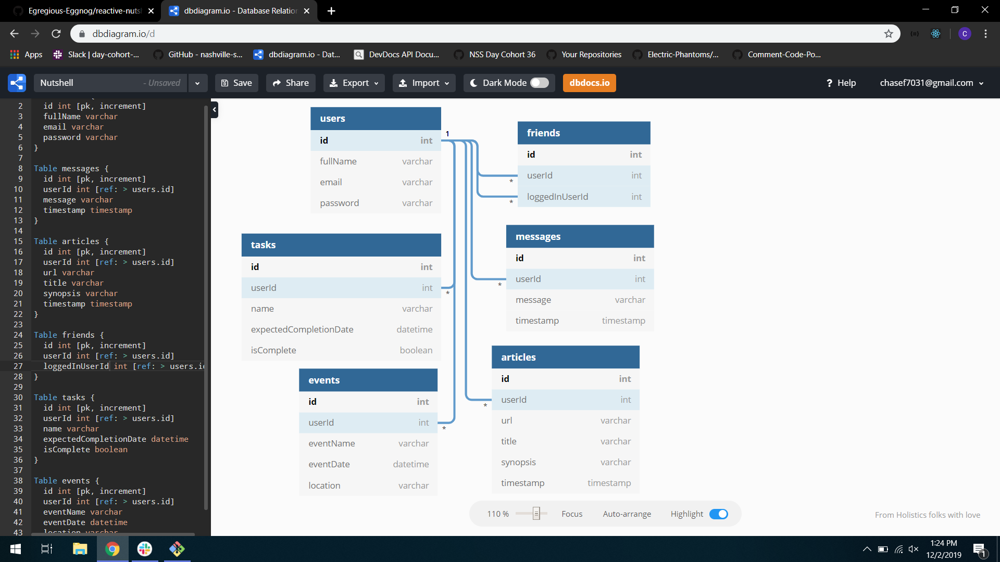

# Reactive Nutshell: The Information Application

## Setup: Follow these steps exactly

1. Clone this repository
1. `cd` into the directory it creates
1. In the `api` directory, create a copy of the `database.json.example` and remove the .example extension.
1. Run `npm install` and wait for all dependencies to be installed
1. Run `npm start` to verify that installation was successful.
1. Start your JSON server

## What is Reactive Nutshell?

Nutshell is an app for people to use to organize their daily tasks, events, news article, friends, and chat messages.

This multi-user app utilizes React library with react-bootstrap styling and JSON server.

Users should login or register if they have not previously logged in.

There are 5 features:

Friends - users can add other users as friends 
Messages - users can view all user messages and create, edit and delete their own 
Tasks - users can view, create, edit and delete their tasks and checkbox will remove it from display 
Events - users can view their own and their friends events; and are able to create, edit and delete their own 
Articles - users can view their own and their friends articles; and are able to create, edit and delete their own

Users should log out once they are done.

## ERD

Enjoy!
